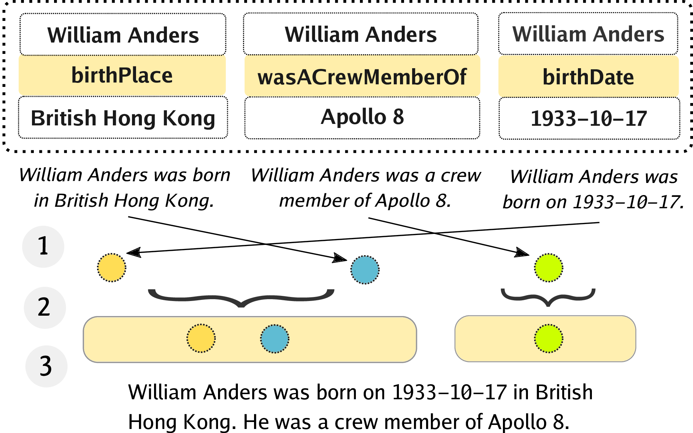

# Neural Pipeline for Zero-Shot Data-to-Text Generation

This repository contains code for zero-shot data-to-text generation from RDF triples using a pipeline of pretrained language models. 

The paper is currently under anonymous review in ACL Rolling Review (November 2021): https://openreview.net/forum?id=Lz2fD-uQyeh

## Model Overview
The model operates over the facts in natural language generated with simple single-attribute templates.

<p align="left">
  
</p>

The text is generated using a three-step pipeline:
1) fact ordering
2) fact aggregation
3) paragraph compression

<!-- ## Quickstart
TODO
 ### Pipeline
1. Install the requirements:
```
pip install -r requirements.txt
```
2. Download the datasets:
```
./download_datasets.sh
```
3. Download the pretrained models:
- fact ordering
- fact aggregation
- paragraph compression
4. Run the pipeline:
```
./run_pipeline.sh --dataset webnlg --gpus 1
``` -->

**Note: The instructions and the code are being improved. We will finalize the repository after the anonymization period.**

## Requirements
The pipeline is built using Python 3, PyTorch Lightning 1.2.5 and HuggingFace Transformers 4.12. 

See `requirements.txt` for the full list of requirements.


## WikiFluent Corpus
See the `wikifluent` directory for instructions on building the WikiFluent corpus. Alternatively, you can download the generated corpus:

- https://ufile.io/swf75rip

*Note: the link is temporary for the anonymization period. We will add permanent links as soon as possible.*

The *filtered* version of the dataset contains only examples which contain no omissions or hallucinations according to `roberta-mnli`.

## Pretrained Models
You can download the pretrained models for individual pipeline steps here:

- **ordering**: https://ufile.io/hrz5yq8l  (see https://github.com/airKlizz/passage-ordering)
- **aggregation**: https://ufile.io/h9mp3wzo
- **paragraph compression (pc-filtered)**: https://ufile.io/4uvkbup5

*Note: the links are temporary for the anonymization period. We will add permanent links as soon as possible. We will also upload the full variety of the pretrained models, including the non-filtered, 2-stage and 1-stage models.*


### Interactive Mode
Tip: you can use any of the models in interactive mode (with manual input from the command line):.

Examples:
```
./interact.py --experiment ord
[In]: Blue Spice is near Burger King. Blue Spice has average customer rating. Blue Spice is a coffee shop. 
[Out]:
['Blue Spice is a coffee shop.',
 'Blue Spice is near Burger King.',
 'Blue Spice has average customer rating.']

./interact.py --experiment agg
[In]: Blue Spice is a coffee shop. Blue Spice is near Burger King. Blue Spice has average customer rating.
[Out]:
[0, 1] # 0=fuse, 1=separate

./interact.py --experiment pc_filtered
[In]: Blue Spice is a coffee shop. Blue Spice is near Burger King. <sep> Blue Spice has average customer rating.
[Out]:
['Blue Spice is a coffee shop near Burger King. It has average customer '
 'rating.']
```


## Preprocessing

1.  Download the [WikiFluent corpus](https://ufile.io/swf75rip) and place it in the `data` directory.
2. Download the D2T datasets:
```
./download_datasets.sh
```
3. Preprocess the D2T datasets. This step will parse the raw D2T datasets to prepare the data for evaluation (the data is not needed for the training).
- WebNLG
```
./preprocess.py 
    --dataset webnlg \
    --dataset_dir data/d2t/webnlg/data/v1.4/en \
    --templates templates/templates-webnlg.json \
    --output data/webnlg_1stage  \
    --shuffle \
    --keep_separate_sents
```
- E2E
```
./preprocess.py 
    --dataset e2e \
    --dataset_dir data/d2t/e2e/cleaned-data/ \
    --templates templates/templates-e2e.json \
    --output data/e2e_1stage  \
    --shuffle \
    --keep_separate_sents
```

## Training

### Ordering
The ordering model is trained on deshuffling the sentences from the wikifluent-*full* corpus. The model is needed for the 2-stage and 3-stage versions of the pipeline.

The implementation of the ordering model is based on the code from https://github.com/airKlizz/passage-ordering. 
```
./train.py \
    --in_dir "data/wikifluent_full" \
    --experiment ord \
    --module ord \
    --gpus 1 \
    --model_name facebook/bart-base \
    --accumulate_grad_batches 4 \
    --max_epochs 1 \
    --val_check_interval 0.05
```

### Aggregation
The aggregation model is trained on aggregating the (ordered) sentences from the wikifluent-*full* corpus.  The model is needed for the 3-stage version of the pipeline.

```
./train.py \
    --in_dir "data/wikifluent_full" \
    --experiment agg \
    --module agg \
    --gpus 1 \
    --model_name roberta-large \
    --accumulate_grad_batches 4 \
    --max_epochs 1 \
    --val_check_interval 0.05
```

### Paragraph Compression
The paragraph compression (PC) model is trained on compressing (=fusing and rephrasing) the paragraphs from the wikifluent corpus. The following options are available:
- `MODULE`: 
  - `pc` - paragraph compression (used in the **3-stage** pipeline)
  - `pc_agg` - aggregation + paragraph compression (used in the **2-stage** pipeline)
  - `pc_ord_agg` - ordering + aggregation + paragraph compression (used in the **1-stage** pipeline)
- `VERSION`:
  - `full` - full version of the wikifluent dataset
  - `filtered` - filtered version of the wikifluent dataset
```
VERSION="filtered"
MODULE="pc"
./train.py \
    --in_dir "data/wikifluent_${VERSION}" \
    --experiment "${MODULE}_${VERSION}" \
    --module "$MODULE" \
    --model_name "facebook/bart-base" \
    --max_epochs 1 \
    --accumulate_grad_batches 4 \
    --gpus 1 \
    --val_check_interval 0.05
```


## Decoding
There are 3 possible pipelines for generating the text from data: 3-stage, 2-stage, or 1-stage (see the paper for detailed description).

To use the commands below, set the environment variables to one of the following:
- `DATASET_DECODE`
  - `webnlg` - WebNLG dataset
  - `e2e` - E2E dataset
- `VERSION`:
  - `full` - module trained on the full version of the wikifluent dataset
  - `filtered` - module trained on the filtered version of the wikifluent dataset

### 3-stage
The following commands will run the 3-stage pipeline:
#### Order the data
```
./order.py \
    --experiment ord \
    --in_dir data/${DATASET_DECODE}_1stage \
    --out_dir data/${DATASET_DECODE}_2stage \
    --splits test
```

#### Aggregate the data
```
./aggregate.py \
    --experiment agg \
    --in_dir data/${DATASET_DECODE}_2stage \
    --out_dir data/${DATASET_DECODE}_3stage \
    --splits test
```
#### Apply the PC model
```
./decode.py \
    --experiment "pc_${VERSION}" \
    --module pc \
    --in_dir data/${DATASET_DECODE}_3stage \
    --split test \
    --gpus 1
```

### 2-stage
The following commands will run the 2-stage pipeline:
#### Order the data
```
./order.py \
    --experiment ord \
    --in_dir data/${DATASET_DECODE}_1stage \
    --out_dir data/${DATASET_DECODE}_2stage \
    --splits test
```

#### Apply the PC+agg model
```
./decode.py \
    --experiment "pc_agg_${VERSION}" \
    --module pc_agg \
    --in_dir data/${DATASET_DECODE}_2stage \
    --split test \
    --gpus 1
```

### 1-stage
The following command will run the 1-stage pipeline:
#### Apply the PC+ord+agg model
```
./decode.py \
    --experiment "pc_ord_agg_${VERSION}" \
    --module pc_ord_agg \
    --in_dir data/${DATASET_DECODE}_1stage \
    --split test \
    --gpus 1
```

The output is always stored in the experiment directory of the pc model (default output name is `{split}.out`).